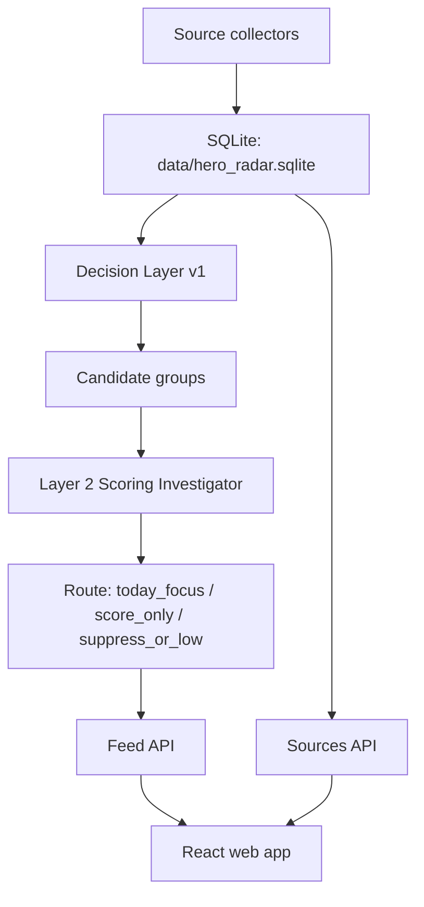

# Hero Radar

Hero Radar 是一个用于发现 AI 应用层机会的本地 intelligence dashboard。

它做的事情很简单：每天从 GitHub、HN、Product Hunt、npm、PyPI、Hugging Face、X 等公开来源抓信号，把同一个项目的跨来源证据合并成候选，再用 Layer 2 Scoring Investigator 做有限工具调用和判分，最后生成 Daily Feed。

当前目标不是做一个“新闻列表”。目标是找到还没有完全成为共识、但已经出现产品/工作流突破的项目。


## 当前界面

Web app 保留一个工作台 shell，目前开放三个入口：

- `Feed`：每日重点、候选信号、完整评分记录。
- `Sources`：原始来源表格，保留每个 source 自己的排序、窗口、指标和链接。
- `Settings`：本地配置控制台，控制 source、搜索词、Layer 2 budgets 和运行按钮。

`Explore` 入口暂时隐藏。这个 agent/search 入口还没有做完整，不应该出现在当前产品里。

### Feed

Daily Feed 分三层：

- `今日重点`：被 scorer 选中并生成中文 brief 的项目。
- `候选信号`：已经评分，分数或质量值得保留，但没有进入今日重点。
- `完整评分记录`：已经评分但低信号、非产品、证据不足或被 scorer 压低的项目。不会隐藏，方便 audit。

Hermes Agent 已被放入 known paradigm，不再作为新范式重点捕捉。它仍会评分，但默认进入下面的 `score_only` 区域。

### Candidate Pool


候选池保持表格。这里看的是 pre-Layer2 的候选宇宙，包括 `high_potential`、`potential` 和 `edge_watch`。

### Sources


Sources 页只展示 source 自己的事实，不做模型判断。这个页面用于追溯证据来源、查看原始窗口、排名、描述和元数据。

### Settings


Settings 页改的是下一次 pipeline run 的配置。保存会写 `pipeline/config.json`，服务端会先做 timestamped backup。

## 架构



核心存储是本地 SQLite：

- `entities`：项目/实体。
- `source_items`：每个 source 的原始行。
- `evidence_rows`：候选触发和证据。
- `potential_candidates` / `edge_watch_candidates`：Layer 1 候选池。
- `l2_candidate_groups`：Layer 2 分组后的候选。
- `l2_scores`：Scoring Investigator 输出。
- `l2_scoring_investigations`：ReAct/tool trace。
- `l2_deepdive_briefs`：中文 brief。
- `l2_feed_runs` / `l2_feed_items`：Daily Feed run 和展示路由。

## Pipeline

### 1. Source collection

```bash
python3 pipeline/run_pipeline.py
```

这一步抓公开 source 并写入 `data/hero_radar.sqlite`。常见 source：

- GitHub Trending
- GitHub Search
- Trending Repos / RepoFOMO
- Hacker News Algolia / Firebase
- Product Hunt
- Hugging Face Spaces
- npm Search
- PyPI RSS
- X tweets via Apify

只跑某个 source：

```bash
python3 pipeline/run_pipeline.py --only github_movers
```

### 2. Decision Layer v1

```bash
python3 -m pipeline.decision.run_decision \
  --db data/hero_radar.sqlite \
  --export-json data/exports/candidates_latest.json
```

这一步做：

- entity resolution
- deterministic source rules
- candidate pool
- evidence rows
- optional README enrichment
- optional resolver/backfill

### 3. Layer 2 Daily Feed

```bash
python3 -m pipeline.decision.run_layer2_feed \
  --db data/hero_radar.sqlite \
  --decision-run-id latest \
  --feed-run-id l2_manual_$(date -u +%Y%m%dT%H%M%SZ)
```

Layer 2 现在默认使用 Scoring Investigator harness：

- concurrency 默认 5。
- 每个候选最多 3 个 investigation turns。
- 每个候选最多 8 次工具调用。
- web search / GitHub README / repo file / homepage fetch 都有单候选 caps。
- candidate-level failure 不会让整轮 run 崩掉。
- scorer 先判断信息是否足够，不足时才调用最小必要工具。
- 高分项目生成中文 `deepdive_brief`。
- known paradigms，例如 `github:nousresearch/hermes-agent`，默认不进今日重点。

### 4. Full daily run

```bash
python3 pipeline/run_daily.py --run-layer2
```

这是一整套日常流程：source collection -> decision layer -> Layer 2 feed。

长批处理建议在本地或 worker 环境跑。Vercel 只适合 UI/API/trigger/small smoke，不适合当主 batch worker。

## 本地运行 Web App

启动 API：

```bash
python3 pipeline/server.py --host 127.0.0.1 --port 8792
```

启动前端：

```bash
cd web
npm install
VITE_API_BASE=http://127.0.0.1:8792 npm run dev -- --port 5176
```

打开：

```bash
open http://127.0.0.1:5176/?section=feed&feed=daily
```

常用 API：

- `GET /api/dashboard-data`：Web app 主 payload。
- `GET /api/feed`：Daily Feed payload，可传 `feed_run_id`。
- `GET /api/candidates`：候选池。
- `GET /api/evidence`：证据查询。
- `GET /api/entity/<entity_id>`：单实体上下文。
- `GET /api/config`：读取配置和 API 状态。
- `POST /api/config`：保存配置，自动备份。
- `POST /api/run`：触发本地 pipeline。
- `POST /api/feed/feedback`：记录 Feed 反馈。

## API keys 和本地 secrets

不要把 key 写进 tracked 文件。

支持的环境变量：

- `GITHUB_TOKEN`：推荐。提高 GitHub Search/Core API rate limit，也用于 README/repo file fetch。
- `PRODUCTHUNT_TOKEN`：启用 Product Hunt GraphQL。
- `PRODUCTHUNT_USER_CONTEXT`：Product Hunt 可选 user context。
- `APIFY_TOKEN`：用于 X following / X tweets actor。
- `APIFY_ENABLE_RUNS=true`：付费 Apify actor 的显式开关，没有它不会真正跑付费 actor。
- `X_AUTH_TOKEN` / `X_CT0`：部分 X actor 需要的登录 cookie，只有跑对应 Apify actor 时才需要。
- `KIMI_API_KEY` 或 `MOONSHOT_API_KEY`：Layer 2 Scoring Investigator / brief。
- `KIMI_BASE_URL` 或 `MOONSHOT_BASE_URL`：可选，默认 `https://api.moonshot.ai/v1`。
- `KIMI_MODEL`：可选，默认使用 repo 内配置的 Kimi 模型。
- `DEEPSEEK_API_KEY`：旧 LLM classifier/eval 路径可能用到，当前 Layer 2 主路径不依赖它。

Kimi 也支持本地 JSON secret：

```json
{
  "kimi": {
    "api_key": "...",
    "base_url": "https://api.moonshot.ai/v1",
    "model": "kimi-k2.5"
  }
}
```

文件路径：`pipeline/secrets.local.json`。这个文件被 git ignore，不要提交。

## 静态 Demo

如果只是给别人看当前版本，推荐用 GitHub Pages 的静态快照，不推荐直接上 Vercel 连接本地 DB。

原因：

- GitHub Pages 不需要后端，不需要 API key。
- Demo 是 read-only，不会触发 pipeline，不会花 Apify/Kimi/GitHub quota。
- 当前 UI、Feed、候选池、Sources、Settings 都能展示。

生成静态 JSON 快照：

```bash
python3 pipeline/export_static_demo.py \
  --output docs/demo/dashboard-data.json \
  --max-items-per-channel-window 20
```

构建静态 app：

```bash
cd web
VITE_STATIC_DASHBOARD_DATA_URL=./dashboard-data.json \
  npm run build -- --base ./ --outDir ../docs/demo --emptyOutDir
```

本地预览：

```bash
python3 -m http.server 4180 --directory docs/demo
open http://127.0.0.1:4180/
```

GitHub Pages 发布方式：

1. push `docs/demo` 到 GitHub。
2. 在 GitHub repo 里打开 `Settings -> Pages`。
3. Source 选 `Deploy from a branch`。
4. Branch 选 `main`，folder 选 `/docs`。
5. 页面地址会类似：`https://<user>.github.io/<repo>/demo/`。

如果用 Vercel，也建议只部署 `docs/demo` 这个静态目录。不要把 full batch worker 放到 Vercel 上跑。

## 数据和提交规则

不要提交：

- `data/hero_radar.sqlite`
- `data/raw/`
- `data/exports/`
- `.env`
- `pipeline/secrets.local.json`
- 任何 token/key 文件

可以提交：

- pipeline 代码
- tests
- docs
- `docs/demo` 静态 read-only demo
- `docs/assets` 截图

## 测试

后端：

```bash
python3 -m unittest tests.test_run_layer2_feed tests.test_feed_api
```

前端：

```bash
cd web
npm test
npm run build
```

静态 demo：

```bash
python3 pipeline/export_static_demo.py --output /tmp/hero-dashboard-demo.json
python3 -m json.tool /tmp/hero-dashboard-demo.json >/dev/null
```
