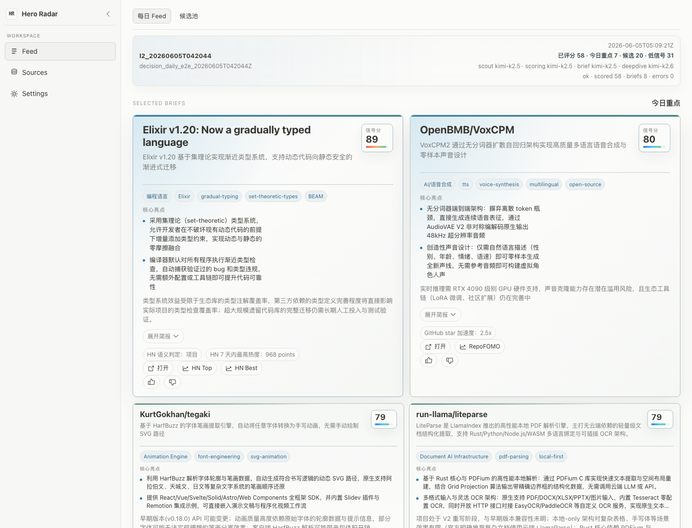
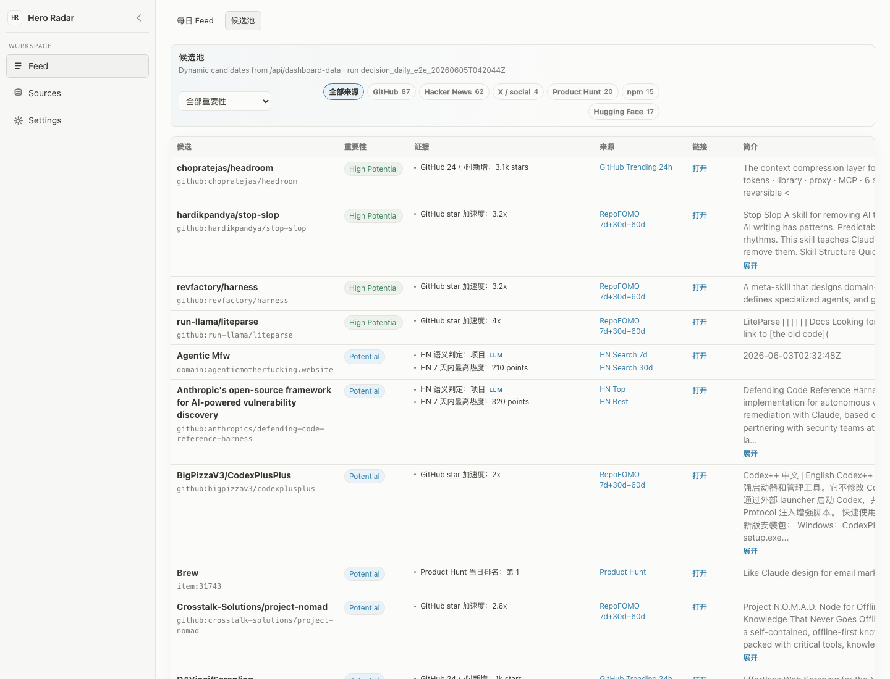
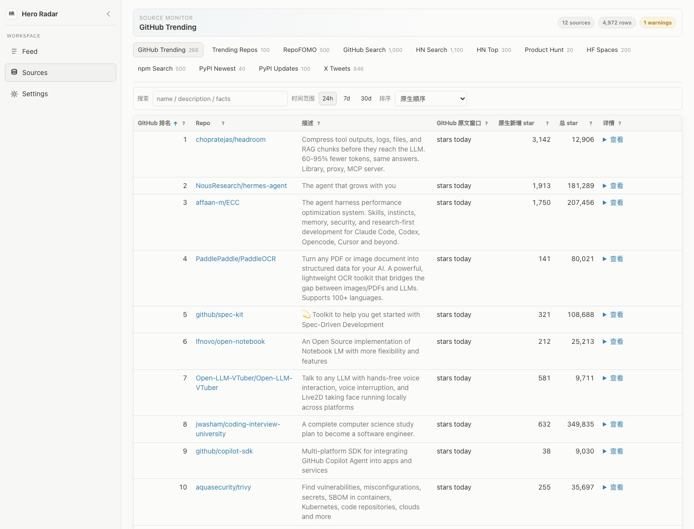
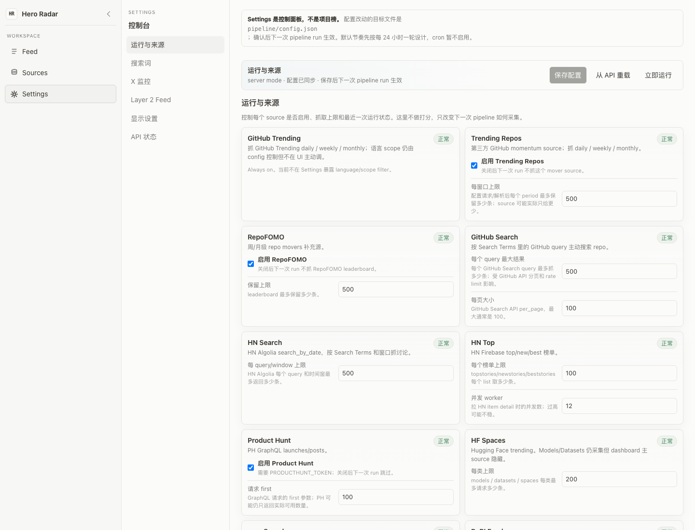
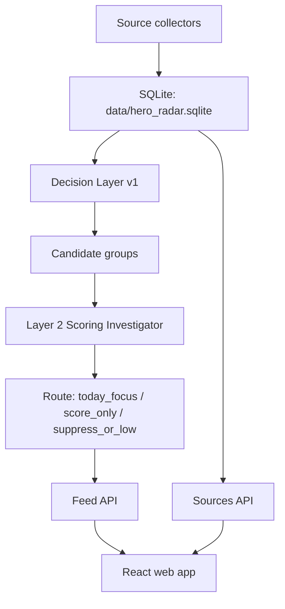

# Hero Radar

Hero Radar 是一个用于发现 AI 应用层机会的本地 intelligence dashboard。

它做的事情很简单：每天从 GitHub、HN、Product Hunt、npm、PyPI、Hugging Face、X 等公开来源抓信号，把同一个项目的跨来源证据合并成候选，再用 Layer 2 Scoring Investigator 做有限工具调用和判分，最后生成 Daily Feed。

当前目标不是做一个“新闻列表”。目标是找到还没有完全成为共识、但已经出现产品/工作流突破的项目。

在线只读演示：
[https://demo-six-sigma-28.vercel.app](https://demo-six-sigma-28.vercel.app)

## AI 使用方式

Hero Radar 不是把所有事情都丢给一个大模型做判断。系统把 AI 分成两层：便宜、批量、结构化的 source classifier；以及更谨慎、更有工具边界的 Layer 2 Scoring Investigator。

### 1. Source / Candidate 层：DeepSeek 做轻量语义分类

Source collection 本身主要是确定性抓取和解析：GitHub、HN、Product Hunt、npm、PyPI、Hugging Face、X/Apify 等来源先写入 SQLite。之后 Decision Layer v1 做 entity resolution、deterministic rules、candidate pool 和 evidence rows。

DeepSeek 用在这一层的“确定性旁路”任务：

- HN/X/npm 等 source 的轻量 semantic classification。
- 把帖子、tweet、package 描述解析成结构化 JSON。
- 判断一个 source item 更像 project/product/repo，还是 topic/news/noise。
- 生成 candidate evidence 的辅助标签，但不直接决定最终 Daily Feed。

这层的原则是 high recall：宁可把可能有价值的东西放进 Candidate Pool，也不要过早让模型过滤掉。Candidate Pool 的 `high_potential` / `potential` / `edge_watch` 仍然是 Layer 1 输出，Layer 2 不会回写修改这些等级。

### 2. Layer 2：Kimi Scoring Investigator 做有边界的 ReAct 判断

Layer 2 使用 Kimi/Moonshot。它的任务是回答：这些候选里，今天哪些真的值得产品/AI 应用层研究？

当前默认不是独立 deepdive agent，而是一个 bounded Scoring Investigator harness：

- 先判断已有 context 是否足够评分；够就直接 final score，不额外浏览。
- 不够时才进入 ReAct loop，调用最小必要工具。
- 每个候选最多 3 个 investigation turns。
- 每个候选最多 8 次工具调用。
- 默认并发评分 5 个候选。
- candidate-level failure 不会让整轮 run 崩掉，会记录为 candidate error 或 ok_with_errors。

可用工具是刻意收窄的 primitive tools：

| Tool | 作用 |
| --- | --- |
| `read_evidence_rows(entity_id)` | 读取该候选的结构化证据、source rows 和入池原因。 |
| `fetch_github_readme(repo_key)` | 获取 GitHub README，补足产品/技术语义。 |
| `fetch_github_file(repo_key, path)` | 读取安全白名单内的 repo 文件，例如 `package.json`、docs、examples。 |
| `fetch_homepage_or_docs(url)` | 抓 homepage/docs 的简化文本。 |
| `web_search(query)` | 可选，最多少量调用，用于补关键缺口。 |

这些工具都需要 bounded、cached、sanitized；URL fetch 要 SSRF-safe；所有 provider token 都不能进入输出或静态 demo。

### 3. Scoring + Brief

Kimi 输出结构化 score，确定性代码再校验 schema、聚合分数、写入 DB。核心字段包括：

- `object_type`
- `is_product_or_repo`
- `workflow_shift`
- `technical_substance`
- `product_market_fit`
- `momentum`
- `confidence`
- `risk_penalty`
- `derivative_news_penalty`
- `l2_score`
- `supporting_evidence`
- `negative_evidence`
- `known_gaps`
- `should_print`

高分项目会生成中文 `deepdive_brief`，用于 Daily Feed 的今日重点卡片。brief 不是复述证据来源，而是解释项目本身：类别、核心亮点、使用场景和 caveat。

### 4. Eval 和校准

这个系统的 AI 部分用 eval 保护，而不是只凭 prompt 感觉：

- deterministic eval 覆盖 OpenClaw、Hermes Agent、HeyClicky、generic chatbot、funding/news、standalone model、tutorial/resource list、ordinary dashboard/editor/calculator、gray-zone utility。
- OpenClaw / Hermes / HeyClicky 必须高分。
- generic chatbot、纯新闻、单独模型发布、教程资源、普通 dashboard/editor/calculator 必须低分，除非证据明确展示了新的 workflow unlock。
- Kimi smoke run 用小规模真实调用验证 JSON schema、ReAct tool trace、失败 fallback、brief 中文质量。
- 20-30 candidate bounded run 用来验证真实 feed routing、cache、tool budgets、API payload 和 UI 展示。

当前 deterministic scorer eval 是 `9/9` 通过。

## 第一步：历史回测

Hero Radar 的第一步不是先把界面做漂亮，而是先回答一个更硬的问题：如果我们当时在跑这套系统，它能不能在 OpenClaw / Hermes Agent 变成共识前，把它们放进 closer-look 队列？

回测文档：

- [docs/benchmark-hermes-openclaw.md](docs/benchmark-hermes-openclaw.md)
- [docs/benchmark-hermes-openclaw-observation-table.md](docs/benchmark-hermes-openclaw-observation-table.md)
- [docs/product-spec-v0.7.md](docs/product-spec-v0.7.md)

这不是最终推荐分数，而是 source-level benchmark：哪些事实足够早、足够强，应该触发高召回 closer look。

### 回测 Anchor

| 项目 | 有用捕捉点 | 太晚的点 | 结论 |
| --- | --- | --- | --- |
| Hermes Agent | 2026-03-11T13:51:05Z 附近的二阶导/加速度 lift，star band 约 `3.4k-5.5k`，中点约 `4.45k` | 2026-04-06T13:29:32Z 的一阶导/velocity peak，star band 已到 `23.3k-37.7k` | 要抓 acceleration，不要等它已经成为大规模共识。 |
| OpenClaw | 2026-01-25 到 2026-01-26 之间，GitHub/HN/npm/HF/PH 围绕 `clawdbot` / `openclaw` 同时亮起 | 只等新名字 `openclaw` 或只看后续大 star 总量 | 必须把 alias resolution 当成信号的一部分，否则会漏掉早期 wave。 |
| Claude Code | 约 `500-800` stars，repo 创建后约 `2.38` 天，star velocity 约 `92.33 stars/hour` | 等它已经几千上万 stars | 早期速度比总量更重要。 |

### Hermes Agent 回测结果

Hermes 是 GitHub acceleration-first case。

- T0：`2026-03-11T13:51:05Z`，二阶导/加速度峰值，star band 约 `3.4k-5.5k`。
- GitHub stargazer page probe 验证：page 34 约 `3.3k-3.4k`，page 45 约 `4.4k-4.5k`，page 55 约 `5.4k-5.5k`。
- T0 到 T+24h 的 GitHub star delta 是 `1094`；T-7d 到 T+7d 的 star delta 是 `6834`。
- T0 到 T+24h 的 fork delta 是 `94`；T0 到 T+7d 的 fork delta 是 `449`。
- HN 在 T0 前后有弱但有用的 canonical corroboration，例如 2026-03-05、2026-03-09、2026-03-11 的 Hermes Agent 相关 story。
- Product Hunt、exact npm、PyPI、HF exact resource 对 Hermes T0 都不够早；它们不能作为 Hermes-like 项目的必需条件。
- 2026-05-30 的 forward-looking snapshot 里，Trending Repos 显示 daily/weekly/monthly rank `9 / 9 / 4`，`stars_velocity=1290.0`，`forks_velocity=330.0`；RepoFOMO 显示 `7d=910`、`30d=5673`、`60d=23204`、`new_forks=1227`。这些适合未来 daily capture，但不能倒推成历史 T0 证据。

Takeaway：Hermes 应该被系统识别为高质量 agent framework，但现在它已经是已知范式，所以在当前产品里会被标记为 `known_paradigm`，默认 score-only，不再占用今日重点。

### OpenClaw 回测结果

OpenClaw 是 alias-chain + cross-source resonance case。

- T0：`2026-01-26T10:32:47Z`，一阶导和二阶导同时峰值，star band 约 `23.3k-37.7k`，中点约 `30.5k`。
- GitHub repo id `1103012935` 证明旧 repo `clawdbot/clawdbot` 会 redirect 到 canonical `openclaw/openclaw`。
- GitHub stargazer page probe 验证：page 233 约 `23.2k-23.3k`，page 305 约 `30.4k-30.5k`，page 310 约 `30.9k-31.0k`，page 377 约 `37.6k-37.7k`。
- T-24h 到 T0 的 GitHub star delta 是 `19760`；T0 到 2026-01-26T19:17:49Z 的 star delta 至少 `9024`；T-7d 到 2026-01-26T19:17:49Z 的 star delta 至少 `35140`。
- Fork velocity 极强：T0 到 T+24h fork delta `3123`，T0 到 T+7d fork delta `16723`，T-7d 到 T+7d fork delta `19294`。
- npm old alias `clawdbot` 是强早期信号：2026-01-24 日下载 `16,242`，01-25 `70,768`，01-26 `106,024`，01-27 `139,824`。
- `@clawdbot/*` scoped package 在 2026-01-25 同步 release，`matrix`、`msteams`、`voice-call`、`zalo` 几乎同一分钟出现。
- HN old alias 很强：紧窗口 2026-01-25..2026-01-27 mixed-case alias query 约 `42` stories；如果只搜 `openclaw`，早期 tight window 会错过。
- Product Hunt 在 2026-01-27T08:01:00Z 出现 `OpenClaw` launch，daily rank `2`，weekly rank `3`，votes `835`，comments `53`。
- Hugging Face 在 T0 前后出现 `KALLLA/clawdbot` model 和多个 `clawdbot` spaces，说明生态 echo 与主 repo 同步。
- 2026-05-30 的 forward-looking snapshot 里，Trending Repos 显示 daily rank `86`、monthly rank `63`、language rank `26`、`stars_velocity=213.5`、`forks_velocity=76.0`；RepoFOMO 显示 `7d=226`、`30d=1735`、`60d=6816`、`new_forks=546`。

Takeaway：OpenClaw 这类项目不能只靠 canonical name。Candidate Pool 必须把 alias、redirect、package family、HN old-name discussion、PH launch、HF echo 合成一个 entity，再交给 Layer 2 判断。

### 回测后形成的高召回规则

回测后，Candidate Pool/Decision Layer 的 closer-look 规则更偏召回：

- GitHub acceleration / recent velocity 异常时入池。
- Trending Repos daily rank <= 100、monthly rank <= 75、language rank <= 30，尤其 `stars_velocity >= 150` 或 `forks_velocity >= 50` 时入池。
- RepoFOMO `stars_7d >= 200`、`stars_30d >= 1000`、`stars_60d >= 5000` 或 `new_forks >= 100` 时入池。
- npm daily downloads 超过 `10k` 且快速上升，或同一 package family 在短时间内集体出现时入池。
- HN 7 天内 >= 3 条匹配 story，或 GitHub acceleration 同日出现 meaningful HN story 时入池。
- Product Hunt daily rank <= 5 是强 corroboration，但不要求每类项目都有 PH。
- Hugging Face 同 alias model/dataset/space 在 48h 内出现多个，或在 GitHub/npm/HN 强信号附近出现，作为 ecosystem echo。

这就是 Candidate Pool 为什么不直接追求 precision：它负责别漏掉 OpenClaw/Hermes 这类事件；precision 留给 Layer 2。

## Layer 2 校准结果

在历史回测之后，Layer 2 Scoring Investigator 再负责判断“这是不是今天值得读”。当前 deterministic eval 结果是 `9/9` 通过：

| 案例 | 期望 | 结果 | 分数 | 判断 |
| --- | --- | --- | ---: | --- |
| OpenClaw | high | high | 80.20 | 应该捕捉。它不是普通聊天入口，而是本地个人 AI 助手/可执行 agent 工作流；回测证据覆盖 GitHub、旧 alias npm 下载、HN 讨论、Product Hunt launch 和 Hugging Face echo。 |
| Hermes Agent | high | high | 78.85 | 应该识别为高质量 agent framework：persistent memory、skill creation、curator、跨 session workspace 都是实质能力。 |
| HeyClicky | high | high | 76.90 | 应该捕捉。cursor-adjacent、screen-aware、voice desktop assistant 是新的桌面交互方式，而不是普通 chat wrapper。 |
| Screen-aware spreadsheet operator | medium | medium | 68.85 | 灰区 utility 只有在明确解锁真实工作流时才可以上来。 |
| Generic AI chatbot | low | low | 30.05 | 普通聊天/文件总结，没有新的 workflow wedge。 |
| Funding/acquisition news | low | low | 29.05 | 纯新闻没有 repo/product artifact。 |
| Standalone model release | low | low | 32.05 | 单独模型发布如果没有 workflow wrapper，不应进入重点。 |
| Tutorial/resource list | low | low | 25.20 | 教程、资源列表不是产品机会本身。 |
| Ordinary dashboard/editor/calculator | low | low | 37.35 | 普通工具即使带 AI 标签，没有明确工作流突破也不该高分。 |



## 当前界面

Web app 保留一个工作台 shell，目前开放三个入口：

- `Feed`：每日重点、候选信号、完整评分记录。
- `Sources`：原始来源表格，保留每个 source 自己的排序、窗口、指标和链接。
- `Settings`：本地配置控制台，控制 source、搜索词、Layer 2 budgets 和运行按钮。

`Explore` 入口暂时隐藏。这个 agent/search 入口还没有做完整，不应该出现在当前产品里。

### Feed

Daily Feed 分三层：

- `今日重点`：被 scorer 选中并生成中文 brief 的项目。
- `候选信号`：已经评分，分数或质量值得保留，但没有进入今日重点。
- `完整评分记录`：已经评分但低信号、非产品、证据不足或被 scorer 压低的项目。不会隐藏，方便 audit。

Hermes Agent 已被放入 known paradigm，不再作为新范式重点捕捉。它仍会评分，但默认进入下面的 `score_only` 区域。

### Candidate Pool



候选池保持表格。这里看的是 pre-Layer2 的候选宇宙，包括 `high_potential`、`potential` 和 `edge_watch`。

Candidate Pool 的职责不是做最终判断，而是保证“值得被 Layer 2 看一眼”的项目不要漏掉。它主要回答：为什么这个 entity 今天进入候选？

入池信号分几类：

- `high_potential`：确定性强信号。通常来自跨来源共振、明显的 GitHub/repo 加速、Product Hunt/HN 高位、包管理器下载异常、或者多个 source 指向同一个项目。
- `potential`：有清晰项目实体和单个强信号，但还缺少足够的跨来源验证。
- `edge_watch`：数据面不一定好看，但可能代表新交互、新技术组合、灰区工作流或早期小众工具。这个层级保留探索性，但不会自动进 Daily Feed。

Candidate Pool 会做 deterministic grouping / dedupe：

- 相同 repo link 必须合并成一个候选。
- canonical link 相同的候选不会重复打分、重复出卡。
- repo、homepage、Product Hunt、HN、npm、PyPI、Hugging Face、X 里指向同一项目的证据会尽量合并到同一个 candidate group。
- `high_potential` 可以作为排序 tie-breaker，但不能绕过 canonical grouping，也不能偷偷给 Layer 2 加隐藏分。

所以 Candidate Pool 的筛选偏 recall，宁可多给 Layer 2 一些候选；Daily Feed 的筛选偏 precision，由 scorer 判断它是不是今天值得看。

## Layer 2 Rubric

Layer 2 只对 `potential` / `high_potential`，以及被允许进入的 `edge_watch` group 做评分。它的目标不是复述热度，而是判断一个项目是否代表新的产品/工作流机会。

Scoring Investigator 输出 0-100 分，并保留这些轴：

| 轴 | 范围 | 作用 |
| --- | ---: | --- |
| `workflow_shift` | 0-100 | 是否改变用户完成任务的方式。比如从聊天窗口转向本地系统控制、浏览器控制、cursor-adjacent assistant、screen-aware operator、agent workspace。 |
| `technical_substance` | 0-100 | 是否有非平庸技术机制或组合。比如 memory/skill creation/curator、可验证的 repo 实现、agent loop、sandbox/tooling、local execution、跨 source artifact。 |
| `product_market_fit` | 0-100 | 是否有明确使用者、问题和产品 wedge。重点看 developer/team/enterprise/creator/researcher/operator 谁会用、解决什么痛点、是否比旧方式更自然。 |
| `momentum` | 0-100 | 是否有可信动量。GitHub、HN、Product Hunt、npm/PyPI、Hugging Face、X 等都可以作为证据，但动量不能替代实质。 |
| `confidence` | 0-100 | 证据是否足够可靠。README、repo、homepage、多个 source 交叉验证会提高 confidence；证据缺失或 claim 过重会降低 confidence。 |
| `risk_penalty` | 0-25 | 滥用、合规、质量、权限、安全、过度 hype 等风险。风险不自动否定项目，但会从总分扣掉。 |
| `derivative_news_penalty` | 0-25 | 纯新闻、二手解读、融资收购、教程资源、单独模型发布等非产品机会会被扣分。 |

当前聚合公式：

```text
l2_score =
  0.25 * workflow_shift
+ 0.25 * technical_substance
+ 0.20 * product_market_fit
+ 0.15 * momentum
+ 0.15 * confidence
- risk_penalty
- derivative_news_penalty
```

还有两个硬约束：

- `workflow_shift`、`technical_substance`、`product_market_fit` 三个核心轴里，最高项低于 70 时，总分最多 69。也就是说，单靠热度不能进高分。
- `news` / `article` 且不是真实 product/repo 时，总分最多 55。

Deepdive 选择默认看分数阈值，不靠主观挑选：

- 默认 `brief_min_score = 70`。
- 目标生成约 8 个中文 brief，最多 10 个。
- 如果少于 5 个真正过线，不强行补弱项目。
- 大厂项目如 Anthropic / OpenAI / Google / Microsoft 默认可以 score-only：它们仍会被评分和展示，但通常不占用新机会 deepdive 卡位。
- known paradigm 如 `github:nousresearch/hermes-agent` 默认 score-only。

### Sources



Sources 页只展示 source 自己的事实，不做模型判断。这个页面用于追溯证据来源、查看原始窗口、排名、描述和元数据。

### Settings



Settings 页改的是下一次 pipeline run 的配置。保存会写 `pipeline/config.json`，服务端会先做 timestamped backup。

## 架构



核心存储是本地 SQLite：

- `entities`：项目/实体。
- `source_items`：每个 source 的原始行。
- `evidence_rows`：候选触发和证据。
- `potential_candidates` / `edge_watch_candidates`：Layer 1 候选池。
- `l2_candidate_groups`：Layer 2 分组后的候选。
- `l2_scores`：Scoring Investigator 输出。
- `l2_scoring_investigations`：ReAct/tool trace。
- `l2_deepdive_briefs`：中文 brief。
- `l2_feed_runs` / `l2_feed_items`：Daily Feed run 和展示路由。

## Pipeline

### 1. Source collection

```bash
python3 pipeline/run_pipeline.py
```

这一步抓公开 source 并写入 `data/hero_radar.sqlite`。常见 source：

- GitHub Trending
- GitHub Search
- Trending Repos / RepoFOMO
- Hacker News Algolia / Firebase
- Product Hunt
- Hugging Face Spaces
- npm Search
- PyPI RSS
- X tweets via Apify

只跑某个 source：

```bash
python3 pipeline/run_pipeline.py --only github_movers
```

### 2. Decision Layer v1

```bash
python3 -m pipeline.decision.run_decision \
  --db data/hero_radar.sqlite \
  --export-json data/exports/candidates_latest.json
```

这一步做：

- entity resolution
- deterministic source rules
- candidate pool
- evidence rows
- optional README enrichment
- optional resolver/backfill

### 3. Layer 2 Daily Feed

```bash
python3 -m pipeline.decision.run_layer2_feed \
  --db data/hero_radar.sqlite \
  --decision-run-id latest \
  --feed-run-id l2_manual_$(date -u +%Y%m%dT%H%M%SZ)
```

Layer 2 现在默认使用 Scoring Investigator harness：

- concurrency 默认 5。
- 每个候选最多 3 个 investigation turns。
- 每个候选最多 8 次工具调用。
- web search / GitHub README / repo file / homepage fetch 都有单候选 caps。
- candidate-level failure 不会让整轮 run 崩掉。
- scorer 先判断信息是否足够，不足时才调用最小必要工具。
- 高分项目生成中文 `deepdive_brief`。
- known paradigms，例如 `github:nousresearch/hermes-agent`，默认不进今日重点。

### 4. Full daily run

```bash
python3 pipeline/run_daily.py --run-layer2
```

这是一整套日常流程：source collection -> decision layer -> Layer 2 feed。

长批处理建议在本地或 worker 环境跑。Vercel 只适合 UI/API/trigger/small smoke，不适合当主 batch worker。

## 本地运行 Web App

启动 API：

```bash
python3 pipeline/server.py --host 127.0.0.1 --port 8792
```

启动前端：

```bash
cd web
npm install
VITE_API_BASE=http://127.0.0.1:8792 npm run dev -- --port 5176
```

打开：

```bash
open http://127.0.0.1:5176/?section=feed&feed=daily
```

常用 API：

- `GET /api/dashboard-data`：Web app 主 payload。
- `GET /api/feed`：Daily Feed payload，可传 `feed_run_id`。
- `GET /api/candidates`：候选池。
- `GET /api/evidence`：证据查询。
- `GET /api/entity/<entity_id>`：单实体上下文。
- `GET /api/config`：读取配置和 API 状态。
- `POST /api/config`：保存配置，自动备份。
- `POST /api/run`：触发本地 pipeline。
- `POST /api/feed/feedback`：记录 Feed 反馈。

## API keys 和本地 secrets

不要把 key 写进 tracked 文件。

支持的环境变量：

- `GITHUB_TOKEN`：推荐。提高 GitHub Search/Core API rate limit，也用于 README/repo file fetch。
- `PRODUCTHUNT_TOKEN`：启用 Product Hunt GraphQL。
- `PRODUCTHUNT_USER_CONTEXT`：Product Hunt 可选 user context。
- `APIFY_TOKEN`：用于 X following / X tweets actor。
- `APIFY_ENABLE_RUNS=true`：付费 Apify actor 的显式开关，没有它不会真正跑付费 actor。
- `X_AUTH_TOKEN` / `X_CT0`：部分 X actor 需要的登录 cookie，只有跑对应 Apify actor 时才需要。
- `KIMI_API_KEY` 或 `MOONSHOT_API_KEY`：Layer 2 Scoring Investigator / brief。
- `KIMI_BASE_URL` 或 `MOONSHOT_BASE_URL`：可选，默认 `https://api.moonshot.ai/v1`。
- `KIMI_MODEL`：可选，默认使用 repo 内配置的 Kimi 模型。
- `DEEPSEEK_API_KEY`：Layer 1 source classifiers / lightweight semantic parsing。

Kimi 也支持本地 JSON secret：

```json
{
  "kimi": {
    "api_key": "...",
    "base_url": "https://api.moonshot.ai/v1",
    "model": "kimi-k2.5"
  }
}
```

文件路径：`pipeline/secrets.local.json`。这个文件被 git ignore，不要提交。

## Demo 和部署状态

当前线上 demo 是静态快照，不连接后端、不触发 pipeline、不需要 API key：
[https://demo-six-sigma-28.vercel.app](https://demo-six-sigma-28.vercel.app)

如果要看实时版本，可以让 Codex 在本机启动 API 和 Web app；如果要每天自动跑，目前项目内已有 `pipeline/run_daily.py --run-layer2` 串起 source collection -> decision layer -> Layer 2 feed，但还没有内置托管式每日定时模块。实际部署时可以很容易用 cron、GitHub Actions schedule、Render/Railway worker cron，或其他 worker scheduler 调用这条命令。

## 测试

后端：

```bash
python3 -m unittest tests.test_run_layer2_feed tests.test_feed_api
```

前端：

```bash
cd web
npm test
npm run build
```

静态 demo：

```bash
python3 pipeline/export_static_demo.py --output /tmp/hero-dashboard-demo.json
python3 -m json.tool /tmp/hero-dashboard-demo.json >/dev/null
```
