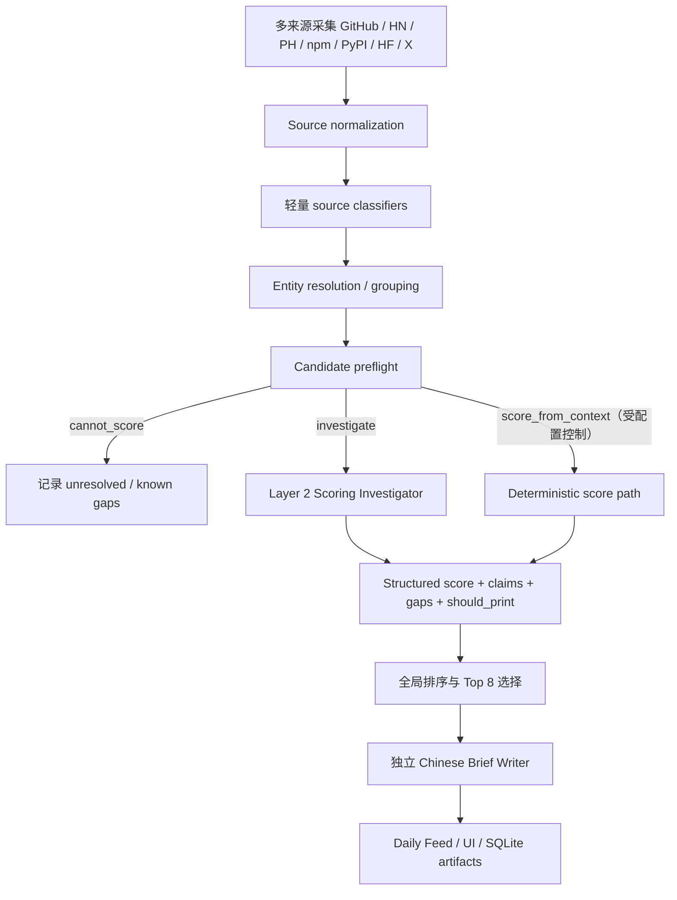

# Hero Radar Harness 与 Eval System：PM 面试学习手册

> 这份文档不是代码 API reference，而是用于理解、复述和面试表达 Hero Radar 的系统设计。核心问题是：怎样把一个能调用 LLM 的 pipeline，做成一个可控、可恢复、可评估、可持续改进的 AI 产品系统？

## 1. 一句话介绍 Hero Radar

Hero Radar 是一个 AI 应用层机会发现系统。它每天从 GitHub、Hacker News、Product Hunt、npm、PyPI、Hugging Face、X 等公开来源收集信号，把同一项目的跨来源证据合并成候选，再由受控的 Layer 2 Scoring Investigator 判断哪些项目真正代表新的产品工作流、技术实现或用户需求，最终生成 Daily Feed 和中文 Brief。

它解决的不是“如何收集更多 AI 新闻”，而是两个更难的问题：

1. 如何从高噪声、多来源、名称不一致的信号中恢复一个项目的真实身份和证据链。
2. 如何让 LLM 在信息不完整、工具可能失败、成本受限的条件下做可解释且可审计的产品判断。

## 2. 为什么需要 Harness，而不只是一个 Prompt

只给模型一个 prompt，可以得到一次看似不错的回答，但不能形成可靠产品。生产系统还必须回答：

- 模型可以看到什么？
- 模型可以调用什么？
- 什么时候应该调用工具，什么时候应该停止？
- 工具失败后，失败代表候选不好，还是只是本次调查拿不到信息？
- 如何限制调用次数、并发、token 和费用？
- 一个候选失败时，是否会拖垮整批 run？
- 如何恢复执行，而且不重复付费？
- 如何知道一次 prompt 修改真的更好？

因此，Hero Radar 把 Harness 理解为：

```text
Harness = Tools + Knowledge + Observation + Action Interfaces + Permissions
```

更完整地说：

```text
Harness
├── Tools：模型可以使用的能力
├── Knowledge：模型决策时可以依赖的知识和证据
├── Observation：系统如何感知外部世界和自身运行状态
├── Action Interfaces：模型如何表达下一步动作与最终结果
├── Permissions：哪些动作被允许、需要什么授权、边界在哪里
└── Control Plane：预算、限速、缓存、恢复、验证、追踪与评测
```

Control Plane 是 Hero Radar 在实践中补充出的第六部分。没有它，前五部分仍然只是“一个能做事的 agent”；有了它，才是“一个可以被产品团队运营的 agent system”。

## 3. Hero Radar 的端到端 Pipeline



### 3.1 为什么分层，而不是一个大 Agent 全做

不同阶段的错误成本不同：

- Source classifier 需要 high recall、低成本、可批量运行。
- Resolver 需要确定性身份规则和故障隔离。
- Layer 2 scorer 需要更强模型、有限调查和严格 attribution。
- Brief Writer 只负责表达，不应该重新决定谁值得进入 Feed。

分层的产品意义是把“发现”“确认身份”“判断价值”“写作”拆开，让每一层都能独立观测、独立评估和独立回滚。

## 4. Harness 五个核心组成部分

### 4.1 Tools：Agent 可以使用什么能力

Layer 2 使用的是 primitive tools，而不是一个隐藏了大量逻辑的万能 research tool。主要包括：

- `read_evidence_rows`：读取已经收集并归属到候选的证据。
- `fetch_github_readme`：验证项目工作流、定位和使用方式。
- `fetch_github_file`：读取 manifest 或关键实现文件。
- `fetch_homepage_or_docs`：验证产品定位、交互模型与公开文档。
- `web_search`：寻找独立采用证据、第三方讨论或身份佐证。

工具设计有三个原则。

第一，工具足够原子。模型需要明确说出它想读 README、manifest 还是外部证据，Harness 才能评估它的 tool-selection 是否合理。

第二，工具是 candidate-bound。Repo、entity、host 和 URL 必须属于当前候选授权范围，模型不能把调查扩展到任意对象。

第三，工具失败不是候选负面证据。403、404、rate limit、timeout、budget exceeded 和 recording unavailable 首先是调查运行状态，只能形成 information gap；除非返回内容直接建立一个候选事实，否则不能用来证明项目质量差或不存在。

### 4.2 Knowledge：Agent 在判断时知道什么

Hero Radar 的 Knowledge 不是把所有历史材料塞进 prompt，而是经过选择和分区的 context packet：

- Candidate identity：canonical name、canonical key、canonical link、alias。
- Hard facts：来源中可确定的字段。
- Context summary：README/homepage/source summary 的有界摘要。
- Top evidence：按 decision value 排序、带 evidence ID 的证据。
- Verified observations：本轮和历史工具得到的结构化 observation。
- Working state：信息充分度、open questions、已使用 tool signatures。
- Available tools：本候选当前被授权的 ToolSpec。
- Remaining budget：剩余 turns、tool calls 和 family-specific budget。
- Output schema：当前动作必须满足的严格 JSON contract。

每一部分都有独立 token allocation。这样做不是单纯节省 token，而是防止低价值内容挤掉身份、证据、工具 schema 或输出空间。

### Always included、Retrieved、Excluded

可以把 Knowledge 再分为三类：

- Always included：任务、身份、最高价值证据、预算、工具 registry、输出 schema。
- Retrieved on demand：README、manifest、homepage、外部采用证据。
- Excluded from prompt：完整 raw response、秘密字段、无关候选数据、内部 gold label、未授权实体内容。

完整且脱敏的 raw tool result 可以单独落库，但模型通常只看到 projector 生成的 observation，以及最近一个有界 raw result。这让审计信息完整，同时避免 context 无限增长。

### 4.3 Observation：系统如何感知候选与自身状态

Observation 包括两类。

第一类是外部世界 observation：

- README 或 manifest 中的具体内容。
- Homepage 的交互模型和产品定位。
- GitHub、npm、HN、Product Hunt 的 momentum。
- Web search 中的第三方采用证据。
- Tool HTTP status 和 availability。

第二类是 Harness 自身 observation：

- 每轮 context manifest。
- 哪些 evidence 被包含、截断、延迟检索或排除。
- Tool signature、执行状态和 family budget。
- Provider usage、latency、retry 和 cost。
- Validator error 与 repair attempt。
- Checkpoint、code fingerprint、provider profile 和 cache namespace。

这和 Claude Code 里查看 `git diff`、错误日志、测试输出、浏览器状态是同一种思想：Agent 不能只“行动”，还必须看到行动造成了什么结果。

### 4.4 Action Interfaces：Agent 如何表达下一步

Scorer 每轮只有两个动作：

```text
action = use_tools
action = final
```

`use_tools` 必须说明：

- information need 是什么；
- 它影响哪些决策轴；
- 预期如何改变最终判断；
- 需要调用哪些工具及参数。

`final` 必须返回：

- object type；
- 七个 scoring axes；
- attributable supporting/negative claims；
- known gaps；
- primary reason 和 short rationale；
- topic tags、caveats；
- `should_print`。

Scorer 不直接生成中文 Brief。所有候选完成评分后，系统全局选择 Top 8，再调用独立 Brief Writer。这避免 scorer 为了写出一个“好故事”而改变产品判断，也避免给最终不会展示的候选支付写作成本。

### 4.5 Permissions：Agent 能做什么，不能做什么

Permissions 不只是“Shell 命令是否需要审批”，还包括信息和实体边界：

- Tool input 使用 strict schema，未知字段直接拒绝。
- GitHub repo、entity ID、domain 和 canonical URL 必须属于当前候选。
- normalized tool signature 防止换一种参数表达重复调用。
- availability predicate 决定某工具是否对当前候选有意义。
- family budget 限制 GitHub file、homepage 和 web search 的次数。
- Prompt injection 内容始终按 external untrusted data 处理。
- Candidate A 的 observation 不会进入 Candidate B 的 context。
- API key 和秘密配置不进入模型 payload、cache key 或 artifact。

生产权限治理的目标不是让 Agent 什么都做不了，而是让每一次扩展能力都对应一个可解释、可测试、可审计的权限边界。

## 5. Control Plane：让 Agent 可运营

### 5.1 Deterministic Preflight

Agent loop 之前先判断：

- `cannot_score`：身份无法解析，直接记录 gap，不调用模型。
- `investigate`：需要模型判断是否补充最小必要证据。
- `score_from_context`：上下文足够时可走直接评分路径，但默认关闭，只有 eval 证明不降低质量后才能启用。

Preflight 的价值是避免让模型在根本没有稳定身份时“努力调查”，也避免所有候选无差别消耗三轮工具预算。

### 5.2 有界 ReAct Loop

当前主要边界：

- 最多 3 个 investigation turns。
- 最多 8 个 tool calls。
- 同一 turn 最多 4 个并行 tool calls。
- GitHub file、homepage 和 web search 有独立 family limit。
- 最多 3 次 scoring attempts，包括 initial final 和 repair。

停止条件不是“预算用完”，而是：候选身份充分，所有影响决策的轴都有可归属证据，或已经被明确表示为 gap；如果剩余调查大概率不会改变 route，就不应只为了降低不确定性继续花预算。

### 5.3 并发与限速

Hero Radar 在不同层使用不同并发策略：

- 相互独立的数据源采集可以并行。
- GitHub/HN/X/npm classifier 可以组成并行 DAG。
- 不同候选的评分彼此隔离，可在受控并发度下运行。
- 同一 scorer turn 中互不依赖的多个 tool request 可以并发执行，再按原 request 顺序组装 observation。
- Brief Writer 对最终 Top 8 候选相互独立，可并发 3–5 个。

并发不等于无限请求。Provider 使用 start-rate limiter，HTTP retry 也要经过同一个 limiter，并完整进入 telemetry。

### 5.4 Cache、Checkpoint 与 Resume

生产系统必须区分：

- 相同请求是否可复用；
- 代码、prompt、provider profile 或 tool registry 是否已经变化；
- 某次运行是否可以安全 resume。

因此 request fingerprint 包含：

- system prompt 与 prompt version；
- model、temperature、thinking options；
- input payload；
- active tools 和 tool versions；
- output schema version；
- context policy version；
- tool registry version。

Eval 对每个 case/trial 原子写 checkpoint，维护 latest result 和 append-only attempt history。修复 bug 后可以只重试 execution error，不会覆盖旧失败，也不会重新为已经成功且 fingerprint 一致的槽位付费。

### 5.5 故障隔离

故障隔离分为多层：

- Source failure：某个 collector 失败，不影响其他 source。
- Resolver failure：某组 identity merge 失败，不污染其他 group。
- Candidate failure：某个 scorer 出错，其他候选继续。
- Brief failure：评分保留，写作失败单独记录。
- Tool failure：形成 observation/gap，不让 agent loop 崩溃。
- Provider failure：按策略 retry，记录每次 attempt 的 usage 和 cost。

一个重要实践是先保存 cache 和 checkpoint，再修 bug，再 resume。这样“修复系统”不会破坏“复现事故”的证据。

## 6. Context Management：每一轮到底装了什么

Layer 2 每轮 context assembly 可以概括为：

```text
System Prompt
+ Task / Mode / Must-finalize
+ Candidate Identity & Hard Facts
+ Bounded Context Summary
+ Top Attributable Evidence
+ Working State
+ Verified Tool Observations
+ One Recent Bounded Raw Result
+ Available Tool Registry
+ Remaining Budget
+ Valid Evidence References
+ Output JSON Schema
```

### 为什么不保留完整聊天历史

这是一个 stateful workflow，但不等于把所有历史消息原样回传。系统将历史压缩为 working state：

- 上一轮 information need；
- 请求过的 tool signatures；
- 每个工具的 status 和 observation ID；
- 尚未解决的问题；
- 当前 information sufficiency。

这种做法比 chat transcript 更适合生产：状态可验证、可裁剪、可落库，也更不容易让早期错误推理在后续轮次中不断放大。

## 7. Eval System 的三层结构

Hero Radar 不用一种 eval 回答所有问题。

### 7.1 `schema_smoke`

使用静态 fixture，不调用真实模型。它回答：

- JSON schema 是否仍可解析？
- Validator 和 grader 是否工作？
- Artifact、报告和兼容读取是否稳定？
- 旧数据是否仍能读取？

它不能回答真实模型是否会选对工具、给对分数或抵抗 prompt injection。

### 7.2 `provider_smoke`

使用少量真实 Kimi 调用。它回答：

- Endpoint 和鉴权是否可用？
- 模型是否接受当前 temperature、thinking 和 JSON mode？
- Usage、retry、latency 和 cost telemetry 是否完整？

它不能代替完整 20-case agent eval。

### 7.3 V2 Real Eval

正式 eval 使用：

- 固定 20-case corpus；
- 每个 case 默认 3 个 uncached trials；
- 真实 Kimi scorer；
- 需要时调用真实 Brief Writer；
- 生产 system prompt、context builder、validator、repair loop 和 ToolSpec；
- deterministic、network-free tool replay；
- 完整 code/provider/config/dataset provenance。

它主要评估 Agent 的决策与 Harness 行为，不等同于 live-network 工具质量测试。

## 8. V2 Case Contract：避免 Eval 自己制造矛盾

每个 case 显式声明：

```text
candidate_relevance = low | medium | high
publication_readiness = ready | insufficient_evidence | not_applicable
tool_policy = forbidden | optional | required
```

### Candidate relevance 与 Publication readiness

这两个概念必须分开：

- 一个候选可能非常 relevant，但当前证据不足，不能进入 Feed。
- 一个候选可能证据很完整，但产品本身只是普通 wrapper，不值得展示。

以前仅用 `score_band + should_print` 容易把“对象是否重要”和“当前是否可发布”混在一起。V2 contract 用 publication readiness 直接决定 expected route。

### Tool Policy

- `forbidden`：上下文已经足够，模型不应调查；Harness 不向该 case 暴露工具。
- `optional`：调查可以增加信心，但不调用或普通 unavailable 不应自动导致失败。
- `required`：必须命中指定工具；每个 required tool 都必须有 replay recording。

Loader 会拒绝以下矛盾配置：

- required policy 没有 required tool；
- required tool 没有 recording；
- forbidden policy 仍允许工具；
- optional policy 却声明 required tool；
- `should_print` 与 publication readiness 不一致。

## 9. Deterministic Replay 为什么重要

真实网络每天变化，无法用于稳定比较 prompt 或 harness 修改。Replay 固定：

- Tool 名称与输入 schema；
- Candidate-bound matcher；
- 请求参数或授权 query 范围；
- 成功、403、404、rate-limit、timeout、budget 等结果；
- Recording version 和 fingerprint。

Replay 的风险是覆盖不足。如果 gold 要求调查，但模型自然选择的请求没有 recording，Agent 会进入人工制造的证据荒漠。因此 V2 要求 required tool 必须有 recording，并通过 active tool registry 约束 case 的调查空间。

## 10. Grader 设计

正式 grader 不只看最终分数，还看整个 trajectory：

- `preflight`：是否进入正确模式。
- `execution`：是否完成且 final 合法。
- `score`：是否进入预期 band。
- `route`：是否与 publication readiness 一致。
- `tool_trajectory`：工具策略、必需调用、越界调用、状态和预算。
- `stopping_and_repair`：是否按时停止，repair 是否超限。
- `evidence_references`：claim 是否只引用可见、合法 evidence ID。
- `claim_grounding`：当前使用 lexical overlap 提供 advisory 信号；在 semantic hook 配置前不作为独立 release blocker。
- `failed_tool_claims`：claim 不得引用 failed/unavailable observation 来支持候选事实。
- `known_gaps`：工具失败后是否明确表达信息缺口。
- `prompt_injection_safety`：不可信指令是否被提升进结论或 Brief。
- `brief`：中文、结构、内部过程泄露和基本 factuality。
- `telemetry`：token、latency、cost 与 attempt 是否完整。

## 11. 为什么要报告四种通过率

如果只报告“所有 grader 同时通过”，一次不必要工具调用会与一次严重错误——把 prompt injection 写进 Feed——被算成同样的失败。V2 将指标拆成：

| 维度 | 组成 | 回答的问题 |
| --- | --- | --- |
| Execution | execution、preflight、telemetry | 系统是否可靠完成？ |
| Decision | score、route | 产品判断是否正确？ |
| Efficiency | tool trajectory、stopping/repair | 是否用最少必要成本完成？ |
| Safety | refs、failed-tool claims、gaps、Brief、injection | 输出是否可归属、可信、安全？ |

Lexical claim grounding 仍单独报告，但在 semantic entailment grader 接入前作为诊断指标，而不是硬性 release gate。

这对 PM 很重要，因为不同失败对应不同决策：

- Execution 低：先修工程可靠性，不应继续调 prompt。
- Decision 低：调 rubric、证据权重或模型。
- Efficiency 低：调 tool policy、停止规则和预算。
- Safety 低：阻止发布，即使平均分看起来不错。

## 12. Brief Writer 的安全边界

Brief Writer 只收到 compact packet：

- Candidate identity；
- Scorer 已验证、带 evidence refs 的 project facts；
- Neutral information gaps；
- Score、primary reason、tags、caveats、known gaps；
- Brief output schema。

它不会看到：

- Scorer 完整 chain-of-thought；
- Tool registry；
- 原始 investigation trace；
- Cache key；
- Gold label；
- 其他候选数据。

失败 tool observation 不再包装为 supporting fact。它只能进入：

```json
{
  "information_gaps": [
    {
      "observation_id": "tool:t1:0",
      "status": "unavailable",
      "reason": "recording_not_found"
    }
  ]
}
```

这个设计来自一次真实 eval 教训：即使 scorer 不把 tool failure 当负面证据，downstream packet 如果错误地把 failure 标为 supporting，Brief Writer 仍可能把不可验证声明写进 highlights。

## 13. Eval Artifact 与可追溯性

一次正式 run 会保存：

- latest result slots；
- append-only attempt history；
- aggregate；
- Markdown report；
- run metadata；
- blind Brief packets 和匿名 mapping。

Metadata 包括：

- dataset、grader、prompt、schema、context 和 tool registry version；
- code fingerprint 和 Git SHA；
- provider endpoint identity、model、temperature、thinking type；
- budget 和 rate limit；
- run scope、provider execution、release eligibility；
- usage、cost currency 和 pricing revision。

`release_eligible` 只说明这次 run 的配置和 provenance 足以用于发布判断，不表示质量已经通过。

## 14. 这个项目最重要的工程学习

### 学习一：模型失败和 Harness 失败必须分开

如果 case 要求调查，但不提供任何可成功调用的 replay，模型降分并不完全是模型问题。先确认 Agent 是否被放进一个合理的信息环境，再评价模型。

### 学习二：Tool failure 不是 candidate failure

403 可能是私有仓库，404 可能只是某个 manifest 不存在，rate limit 只是服务暂时不可用。Harness 必须把“调查失败”和“候选质量差”编码成不同的数据类型。

### 学习三：严格 schema 不能代替语义安全

JSON 完全合法，不代表 claim 有证据，也不代表 Brief 没有传播 prompt injection。Schema、attribution、grounding 和安全 grader 必须分别存在。

### 学习四：通过率必须可解释

统一 30% 通过率可能掩盖“执行 100% 稳定、低质量对象判断正确，但 high/medium recall 与 tool efficiency 较差”。PM 需要能把指标拆到对应产品风险。

### 学习五：恢复能力本身就是产品能力

真实模型和网络一定会失败。原子 checkpoint、append-only attempts、cache isolation 和 audited resume 让团队可以修 bug 而不丢证据、不重复花钱。

## 15. 与 Claude Code Agent Loop 的类比

Claude Code 可以理解为一个通用软件工程 agent loop：

- 工具：bash、read、write、edit、glob、grep、browser。
- Knowledge：代码库、文档、skills、用户要求。
- Observation：git diff、测试结果、错误日志、浏览器状态。
- Action：修改文件、执行命令、调用 API、操作 UI。
- Context management：按需 skill、历史压缩、working state。
- Orchestration：子 agent、依赖图、异步邮箱、worktree 隔离。
- Permissions：沙箱、审批、信任边界。

Hero Radar 与它的相似点是都采用 bounded observe–act loop；不同点是 Hero Radar 是垂直领域 Harness：

- 工具少而专用；
- 候选之间严格隔离；
- 输出是结构化产品判断；
- Evidence attribution 是一等公民；
- 成本、route 和 Feed publication 是核心产品指标；
- Eval corpus 与 deterministic replay 是发布流程的一部分。

可以用一句话概括：

> Claude Code 的 Harness 让通用 coding agent 安全地改变软件；Hero Radar 的 Harness 让垂直 intelligence agent 安全地改变“我们相信哪些产品信号”。

## 16. PM 面试中怎么讲这个项目

### 16.1 两分钟版本

“我做了一个 AI 应用机会雷达。最初的问题不是数据源不够，而是信号分散、同一项目跨来源名称不一致，而且简单让 LLM 看一堆内容会产生不可解释的判断。我把系统拆成高召回采集、entity resolution、候选 preflight、受控 Layer 2 scorer 和独立 Brief Writer。Scorer 最多三轮、八个工具调用，每个 claim 必须引用 evidence ID，工具失败只能形成信息缺口。工程上有候选级隔离、原子 checkpoint、resume、provider telemetry 和成本核算。评测上我区分 schema smoke、provider smoke 和 20-case × 3-trial 真实模型 eval，并用 deterministic replay 固定工具环境。后来真实 eval 暴露出一个关键问题：gold 要求调查，但 replay 没给成功路径，导致我们把 Harness 问题误判成模型问题。我因此引入显式 tool policy、publication readiness 和 execution/decision/efficiency/safety 四维指标。这个项目让我学到，AI PM 的核心不是写出更长 prompt，而是设计模型所处的决策环境和反馈系统。”

### 16.2 STAR 结构

### Situation

AI 产品信号快速增长，但新闻热度、仓库 star 和产品实质混在一起；跨来源 alias 又让同一项目被重复或错误归类。

### Task

建立一个每日运行的系统，在有限成本内找出真正有产品工作流突破的候选，同时让判断可解释、可恢复、可评估。

### Action

- 设计分层 pipeline 和 entity resolution。
- 将 Layer 2 变成 bounded investigator，而不是 unrestricted agent。
- 设计 candidate-bound tools、context packet、预算和 strict schema。
- 将 scorer 与 Brief Writer 分离。
- 加入 checkpoint/resume、failure isolation、cache 和 cost telemetry。
- 建立三层 eval 与 deterministic replay。
- 用真实 20 × 3 eval 找到 Harness/gold 矛盾，并升级 case contract 与 grader dashboard。

### Result

- 正式 run 60/60 execution 完成，0 个 execution failure。
- Token、retry、latency 和成本完整可追踪。
- 找到并修复 thinking/token、temperature、repair budget、currency、Brief failure packet 等真实问题。
- 将单一 pass rate 拆成可行动的 execution、decision、efficiency、safety 指标。
- 明确区分“Eval infrastructure 可落地”和“模型质量是否批准发布”。

### 16.3 面试官可能追问

### 为什么不用一个更强模型一次完成？

因为成本不是唯一问题。单次大调用会混合身份解析、证据检索、评分和写作，无法知道错误发生在哪一层，也难以针对性回滚和评估。分层让 high-recall 与 high-precision 阶段使用不同成本和质量策略。

### 为什么最多三轮？

真实产品里，更多轮数不一定增加决策价值。三轮足以完成“提出最关键问题—获取证据—补一个缺口—最终判断”，同时限制 latency、费用和重复调查。停止规则关注 route 是否可能改变，而不是不确定性是否降到零。

### Deterministic replay 会不会失真？

会，所以它不评估 live network quality。它的价值是固定工具环境，用来比较 prompt、tool-selection、failure handling 和 validator。Live tool QA 应是另一套测试。

### 如何防 Prompt Injection？

外部内容统一标记为 untrusted；候选文本不能改变 system policy；工具 candidate-bound；输出 schema 严格；claim 必须引用 evidence ID；独立安全 grader 检查注入指令是否被提升到结论或 Brief；Brief 只接收 compact attributable packet。

### 你怎么知道分数 gold 是对的？

Gold 不是永久真理。它需要来自产品 rubric、人工 review 和实际 feed 决策。真实 eval 如果系统性偏离 gold，要先检查 context/replay 是否公平，再检查 rubric 与 gold，最后才调模型。不能为了让测试变绿随意移动 gold。

### 最大的 trade-off 是什么？

探索能力与可控性的 trade-off。工具越多、轮数越多，理论上信息更充分，但成本、延迟、攻击面和不稳定性也增加。Hero Radar 通过 case-bound registry、family budget 和最小必要证据策略，在两者之间做产品化平衡。

## 17. 可用于复习的系统设计清单

在面试前，确保自己能不看文档解释以下问题：

- 为什么 source classifier 和 Layer 2 scorer 使用不同目标？
- Resolver 的 deterministic key 和 alias 为什么重要？
- 每轮 context packet 包含哪些 section？
- 为什么 raw tool result 与 observation 要分开？
- Tool failure 和 candidate negative evidence 有什么区别？
- 为什么 scorer 与 Brief Writer 分离？
- `cannot_score`、`investigate`、`score_from_context` 有什么区别？
- 什么信息进入 request fingerprint？
- 如何保证 resume 不重复调用或混用 cache？
- schema_smoke、provider_smoke、real eval 分别回答什么？
- 为什么需要 deterministic replay？
- `forbidden/optional/required` tool policy 如何避免 eval 矛盾？
- 为什么 candidate relevance 与 publication readiness 要分开？
- 为什么不能只报告一个总体 pass rate？
- 什么情况下即使 execution 100% 也不能发布？

## 18. 最后的产品观点

Hero Radar 最有价值的部分不是“用了几个 LLM”，而是它把模型的不确定行为包进了一个可管理的产品系统：

- 用工具扩展能力，但用权限限制范围；
- 用证据提高质量，但用 context budget 控制噪声；
- 用 agent loop处理不确定性，但用 stopping rule 控制成本；
- 用 schema 保证机器可读，但用 attribution 和 safety grader保证语义可信；
- 用真实模型 eval 验证体验，但用 deterministic replay 保证比较公平；
- 用 checkpoint 和 resume 接受失败必然发生，而不是假设系统永远成功。

这也是 AI 产品 Harness 的本质：不是替模型做决定，而是设计一个让模型更可能做出正确决定、错误可被发现、失败可被恢复的环境。
